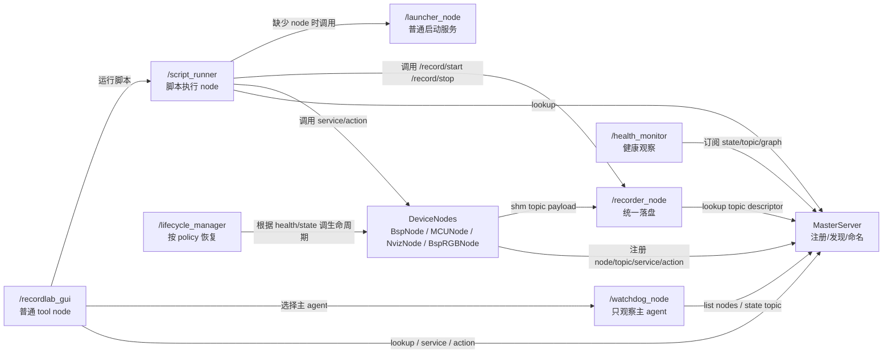
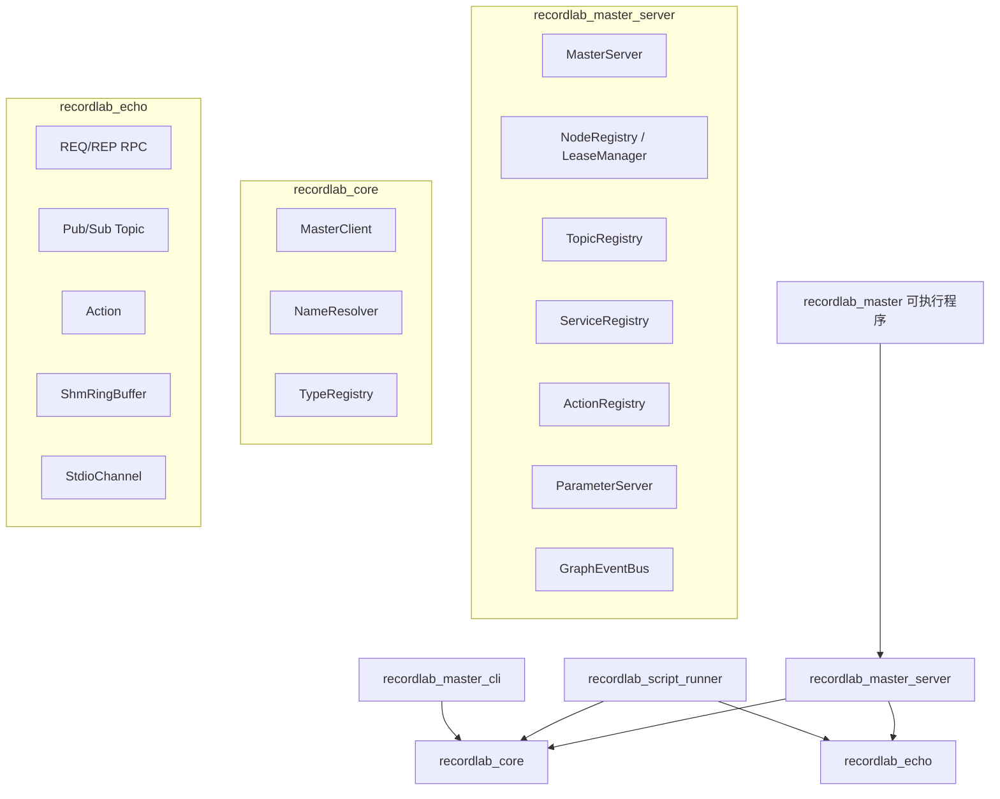
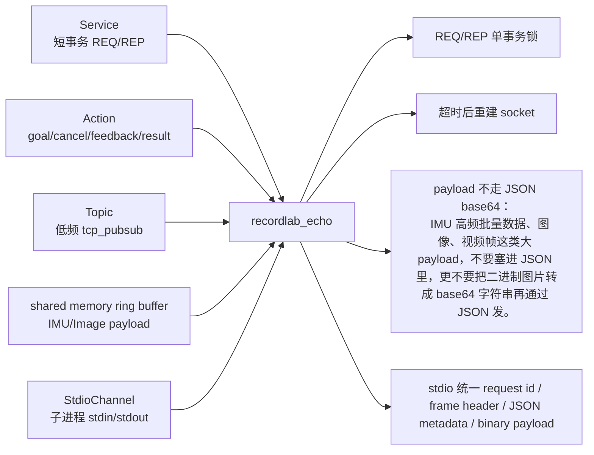
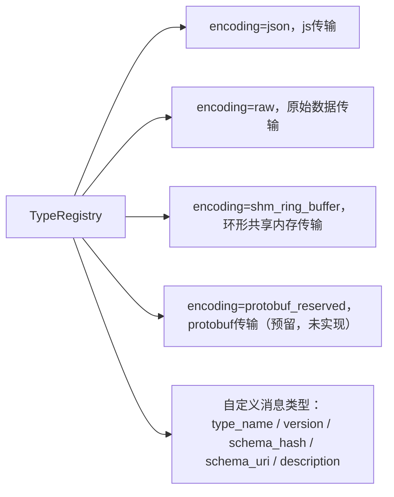
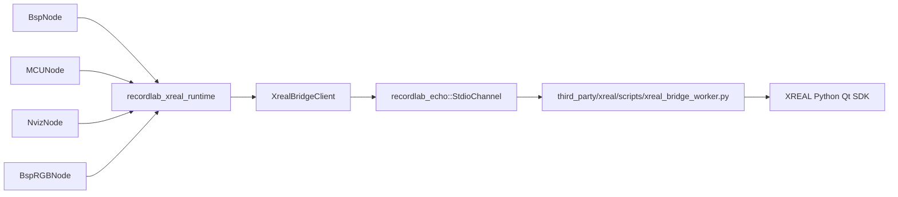
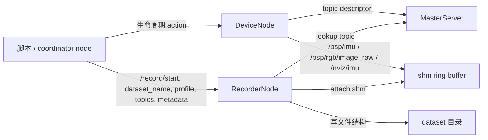
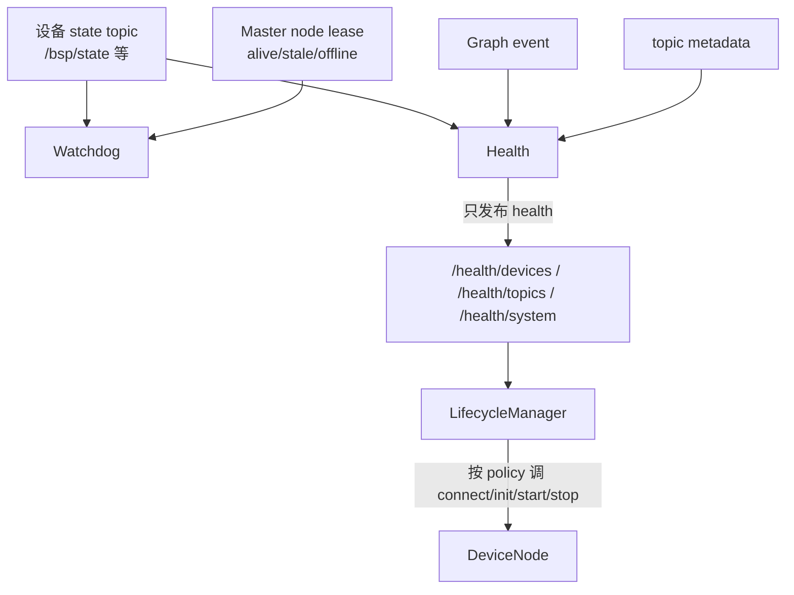

# Recordlab重构计划

## Summary

创建两个新仓库，`Recordlab_master + Recordlab_nodes`。

最终标准：严格按 ROS 设计理念，`MasterServer` 只做控制面，`recordlab_core` 做客户端 API 和通用 node 基类，`recordlab_echo` 做统一通信层，`Recordlab_master` 放稳定 system/tool node，`Recordlab_nodes` 只放设备节点和设备 SDK 适配，`RecorderNode` 负责落盘。

## 总体关系图



## Recordlab_master

实现 host 控制面和通用通信、控制。

- `Recordlab_master` 不应该随着业务变化，业务增加而变动。
- `recordlab_script_runner` 虽在 `Recordlab_master` 仓库中，但运行时是普通 `/script_runner` node，不是 `MasterServer` 内部能力。
- `system_nodes` 和 `tool_nodes` 属于 `Recordlab_master` 仓库：它们是稳定基础设施，开发 device node 的人无权修改。
- 这些 system/tool 运行时仍然是普通 node，只通过 Master 注册/发现，不进入 `MasterServer`。

#### Recordlab_master目录结构

```text
recordlab_master/     # 只包含 MasterServer、registries、graph event、lease
recordlab_core/       # node client、NodeBase、service/action/topic API、NameResolver、TypeRegistry、日志 API
recordlab_echo/       # tcp、ipc(本机不同进程通信)、shared memory、StdioChannel
                      # 旧 echo_message_system 的消息订阅全部走 IP 端口广播、tcp
                      # 后续优化统一进入 recordlab_echo，避免通信能力散落导致架构破坏
system_nodes/         # recorder、watchdog、health_monitor、lifecycle_manager、launcher
tool_nodes/           # recordlab_gui
config/               # recordlab_gui.json、recordlab_launcher.json
scripts/              # start_recordlab.sh
```

物理目录和 target：

```text
recordlab_master/
  MasterServer
  NodeRegistry
  TopicRegistry
  ServiceRegistry
  ActionRegistry
  ParameterServer
  GraphEventBus
  LeaseManager

recordlab_core/
  MasterClient
  NameResolver
  TypeRegistry
  ParameterClient
  NodeBase
  UserLogPublisher
  Logger
  Node/Topic/Service/Action API

recordlab_echo/
  echo.h
  rpc.h/.cpp
  pubsub.h/.cpp
  action.h/.cpp
  shm_ring_buffer.h/.cpp
  endpoint.h/.cpp
  wire_protocol.h/.cpp
  stdio_channel.h/.cpp
```

CMake target：

```text
recordlab_echo
recordlab_core
recordlab_master_server
recordlab_system_nodes
recordlab_tool_nodes
```

工具依赖关系：

```text
recordlab_master        -> recordlab_master_server
recordlab_master_cli    -> recordlab_core
recordlab_script_runner -> recordlab_core + recordlab_echo
recorder_node           -> recordlab_system_nodes
watchdog_node           -> recordlab_system_nodes
health_monitor          -> recordlab_system_nodes
lifecycle_manager       -> recordlab_system_nodes
recordlab_launcher      -> recordlab_system_nodes
recordlab_gui           -> recordlab_tool_nodes + recordlab_core + recordlab_echo + Qt
```

兼容策略：旧 include wrapper 可以保留，例如 `recordlab_master/transport.h`、`recordlab_master/shm_ring_buffer.h`，但 wrapper 只转发到 `recordlab_echo`。新代码不得继续直接使用旧路径。

#### Recordlab_master内部组件

| 组件                    | 负责什么                                                     | 不负责什么                                     |
| :---------------------- | :----------------------------------------------------------- | :--------------------------------------------- |
| MasterServer            | 对外提供 API / RPC 入口                                      | 不处理设备、不转发数据                         |
| NodeRegistry            | node 注册、注销、心跳、在线状态                              | 不知道 node 内部怎么 connect/init/start        |
| TopicRegistry           | 记录 topic 名字、类型、publisher、subscriber、transport 描述（支持共享内存等优化） | 不保存 topic 数据，不转发 IMU/视频             |
| ServiceRegistry         | 记录 service 名字、请求/响应类型、提供方 endpoint            | 不执行 service                                 |
| ActionRegistry          | 记录 action 名字、goal/result/feedback/cancel endpoint       | 不管理 action 状态机                           |
| ParameterServer         | 保存静态配置，管理config，比如 namespace、路径、profile 名称 | 不保存运行状态，不保存默认启动细节             |
| GraphEventBus           | 发布 graph 变化：node 上线、topic 出现、service 消失         | 不发布设备业务状态                             |
| NameResolver            | 处理 /bsp/imu、相对名字、namespace、remap                    | 不关心设备类型                                 |
| TypeRegistry            | 记录Message schema、版本、hash，自定义Message                | 不解析业务语义                                 |
| LeaseManager            | 判断 node alive/stale/dead，清理注册项                       | 不自动 init/start/recover                      |
| Recordlab_script_runner | 独立可执行程序，运行时注册为 /script_runner 结点。执行 Python 脚本，脚本通过 MasterClient/ActionClient/TopicSubscriber 协调多节点 | 不允许直接访问设备 SDK，不允许内置设备恢复策略，只能使用上层提供的控制平面 |
| UserLogPublisher        | 发布 GUI 用户可见日志 `/recordlab/user_log`，级别固定 `INFO/WARN/ERROR` | 不记录调试细节，不替代系统日志 |
| Logger                  | 记录系统/组件日志到 stderr 和文件                            | 不自动展示到 GUI                               |

#### Recordlab_master稳定通用结点

| 结点             | 负责什么                                                     | 不负责什么                                  |
| :--------------- | :----------------------------------------------------------- | :------------------------------------------ |
| WatchDog         | 显示主agent状态；合成 Master node lease 与目标 node state topic，判断进程 alive/stale/offline 和真实设备 connected/started/error | 不做init，start等影响生命周期的操作，只显示 |
| LifecycleManager | 订阅 health/state 根据 policy 自动重连、重新 init、恢复 start，管理生命周期 | 不做一键启动，不关心 UI                     |
| GUI              | ui界面，作为结点，使得逻辑链路与ui分离，方便ai做测试，修bug  | 不关心任何内部实现，不拥有生命周期状态机     |
| RecorderNode     | 订阅 shm ring buffer，负责数据落盘，不放在 MasterServer ，因为录制输出的需求会变 | 不关心数据是如何产生的                      |
| LauncherNode     | 作为普通 node，根据脚本或 GUI 请求启动缺失 node              | 不是 Master 能力，不是一键启动流程           |

#### 日志系统边界

Recordlab 明确有两套日志系统，都放在 `Recordlab_master`：

- 用户可见日志：`recordlab_core::UserLogPublisher` 发布 `/recordlab/user_log`，消息类型 `recordlab_msgs/UserLog`，字段包含 `timestamp_ms/source_node/level/category/message/details`。`level` 固定为 `INFO/WARN/ERROR`。GUI 只展示这套日志。开发者必须显式发布用户日志，普通系统日志不会自动进入 GUI。默认追加写入 `${RECORDLAB_LOG_ROOT}/YYYYMMDD/user/<source_node>.log`；未设置时写 `Recordlab_master/logs/YYYYMMDD/user/<source_node>.log`。
- 系统/组件日志：`recordlab_core/logger.h` 提供 `RL_LOG_DEBUG/INFO/WARN/ERROR`。默认写 stderr 和 `${RECORDLAB_LOG_ROOT}/YYYYMMDD/system/<component>.log`，未设置时写 `Recordlab_master/logs/YYYYMMDD/system/<component>.log`。这套日志用于 Master、system/tool node、device node 和组件调试记录。

`/script_runner/log` 短期保留兼容旧订阅方；新 GUI 订阅 `/recordlab/user_log`。

#### Master 内部模块图



#### recordlab_echo 通信模块



#### TypeRegistry Protobuf 预留

第一版不引入 Protobuf runtime，不生成 `.proto`。`TypeRegistry` 只保留未来接入 Protobuf 的口子。

字段：

- `type_name`
- `version`
- `encoding`
- `schema_hash`
- `schema_uri`
- `description`

第一版允许：

- `json`
- `raw`
- `shm_ring_buffer`
- `protobuf_reserved`




关键约束：

- `Recordlab_master` 不应该随着业务变化、业务增加而变动。
- Master 不启动节点，不执行 Python 脚本，不保存设备 start 参数，不自动恢复设备，不转发 IMU/视频 payload。
- `recordlab_echo` 是新架构通信模块，不等于旧 `third_party/echo_message_system`。
- Protobuf 第一版不实现，只在 `TypeRegistry` 留口子。
- 录制落盘统一归 `RecorderNode`。
- Helen 统一改名为 `MCUNode`，这里的 MCU 指代无 Linux 系统的设备。
- Watchdog/HealthMonitor 只观察，LifecycleManager 才能按 policy 恢复。
- BSP/NVIZ/MCU 不再拥有录制落盘职责。
- XREAL SDK bridge 拔高为 `Recordlab_master` 内独立可选库 `recordlab_xreal_runtime`，供 `BspNode / MCUNode / NvizNode / BspRGBNode` 复用；它不链接进 `MasterServer`。


## Recordlab_nodes

实现真实设备节点和设备 SDK 适配层，参考 RecordLabC 的 C++ 实现，但重新按 ROS 边界拆分。`Recordlab_nodes` 不再包含 `system_nodes` 和 `tool_nodes`，这些稳定基础设施迁移到 `Recordlab_master`。

#### Recordlab_nodes目录结构

```text
device_nodes/
  bsp/
  mcu/
  nviz/
  bsp_rgb/      # 后续 raw/reboot 独占链路
  ur/           # 后续
  android/      # 后续

device adapters link to:
  Recordlab_master/recordlab_xreal_runtime
```

#### Recordlab_nodes内部组件

| 组件           | 负责什么                                                     | 不负责什么                              |
| :------------- | :----------------------------------------------------------- | :-------------------------------------- |
| NodeBase       | 已迁移到 `Recordlab_master/recordlab_core`，供所有普通 node 和设备 node 复用 | 不放在设备仓库中由设备开发者修改        |
| DeviceNodeBase | 标准生命周期：  check、connect、init、start、stop、release、close<br />发布统一 state topic | 不关心生命周期切换的实现细节            |

#### Recordlab_nodes真实设备结点

真实设备结点通过不同的DeviceAdapter进行不同方式的连接。

| 结点                                                         | 负责什么 |
| :----------------------------------------------------------- | :------- |
| BspNode                                                      | BSP 主链路设备 node。负责 `check/connect/init/start/stop/release/close`，发布 `/bsp/state`、`/bsp/imu`、`/bsp/rgb/image_raw`、`/bsp/slam/image_raw`。不负责录制落盘。 |
| MCUNode（原 HelenNode 命名已废弃）                           | 指代无 Linux 系统的设备。负责 MCU 类设备生命周期和数据 topic。设备私有连接/初始化细节只放在 MCU adapter。 |
| NvizNode                                                     | 负责 NVIZ 生命周期、pilot/shell/TCP/UDP 数据解析边界，发布 `/nviz/state`、`/nviz/imu`、`/nviz/time_delay`、`/nviz/motion_status`、`/nviz/record_timer`、`/nviz/tree_data`。不负责录制落盘。 |
| AndroidNode                                                  | 后续 Android 设备接入 node。 |
| UrNode（远端）                                               | 后续 UR 远端机械臂 node，业务脚本通过 Master lookup 调用其 action/service。 |
| BspRGBNode（由于获取raw需要reboot两次，RGB链路需要独占，生命周期的逻辑完全不同于BspNode，所以单开一个） | 后续 BSP raw/reboot 独占链路，不挤进 BspNode 主链路。 |

## XREAL Runtime（目前c++与python XREAL SDK 的通信方案）

`recordlab_xreal_runtime` 是 `Recordlab_master` 中的独立 XREAL 设备 SDK 适配库，供 `BspNode / MCUNode / NvizNode / BspRGBNode` 复用。

- `recordlab_xreal_runtime` 不注册为 node。
- `recordlab_xreal_runtime` 不进入 Master graph。
- `recordlab_xreal_runtime` 不链接进 `MasterServer`。
- `recordlab_xreal_runtime` 不决定业务流程。
- `recordlab_xreal_runtime` 不决定录制目录。
- **XREAL SDK 底层是 Python Qt，回调传出 Python/Qt 对象，C++ 不能很干净地直接拿 Python/Qt 对象**，因此保留 `xreal_bridge_worker.py` 子进程隔离。
- C++ 与 Python worker 的 stdin/stdout 通信统一封装为 `recordlab_echo::StdioChannel`。
- `Recordlab_master/third_party/xreal/` 只放 XREAL wheel、runtime、worker/probe/bootstrap 脚本，不放 Recordlab 业务逻辑。
- `Recordlab_master/config/glasses_device_catalog.json` 是 Recordlab 自有配置，不属于 third-party。



## 录制边界

设备 node 不再拥有录制落盘职责，废弃以下接口：

- `/bsp/start_record`
- `/bsp/stop_record`
- `/nviz/start_record`
- `/nviz/stop_record`

统一由 `RecorderNode` 提供：

- `/record/start`
- `/record/stop`
- `/record/status`

脚本传入：

- `dataset_name`
- `record_profile 输出格式定义（包含目录结构，文件结构）`
- `topics`
- `metadata`

`RecorderNode` 通过 Master lookup topic，订阅 shm ring buffer 并落盘。BSP/NVIZ/MCU 只负责生命周期和发布数据 topic。



## Watchdog / HealthMonitor / LifecycleManager 分工



Watchdog 目标由 GUI 选择，但状态必须合成两类信息：

- Master node lease：进程是否 alive/stale/offline。
- 目标 node 的 state topic：真实设备是否 connected/started/error。

对 `/bsp_node`，拔掉眼镜时应由 `/bsp/state.health=error` 体现。Watchdog 不调用 `check/connect/init/start`，也不做恢复。

## BSP 真机链路边界

- `check`：非侵入式，只做 `lsusb + SDK enumerateDevices`，不 open 眼镜，不读 FSN。
- `connect/init`：由 `BspDeviceAdapter` 持有 `recordlab_xreal_runtime` bridge，读取 FSN，发布到 `/bsp/state`。
- `start`：启动 IMU/RGB/SLAM 数据流，写入 shm ring buffer。
- `RecorderNode`：录制期间读取 shm ring buffer，生成 BSP IMU/Camera 文件结构。

## 业务脚本迁移

- `record_bsp_imu_cam.py` 调 `/bsp/check`、`/bsp/connect`、`/bsp/init`、`/bsp/start`，然后调用 `/record/start` 和 `/record/stop`。
- `record_ur_gt_3dof_batch.py` 迁移为 `record_nviz_ur_gt_3dof_batch.py`。
- 多节点协作由脚本完成：通过 Master lookup 找 `/nviz_node`、`/ur_node`、`/localhost_node`、`/recorder_node`。
- 缺少节点时，脚本只可调用普通 `/launcher_node` 的 `/launcher/start_node`。
- Master 不参与业务流程。

## ROS 设计原则护栏

禁止事项：

- Master 不启动节点。
- Master 不执行 Python 脚本。
- Master 不保存设备 start 参数。
- Master 不自动恢复设备。
- Master 不转发 IMU/视频 payload。
- UI 不拥有生命周期状态机。
- Watchdog/HealthMonitor 不偷偷 init/start 设备。
- BSP/NVIZ/MCU 不负责录制落盘。
- 不再实现“一键启动”按钮或一键流程。

允许事项：

- ScriptRunner 可以执行用户脚本，但它是普通 node。
- LauncherNode 可以按脚本请求启动缺失节点；这不算 Master 一键启动。
- LifecycleManager 可以自动恢复，但它是普通 node。
- DeviceAdapter 可以处理设备私有细节，但只在对应 device node 内部。
- GUI 只作为客户端观察和触发 service/action。

## Test Plan

Master：

- `test_name_resolver`
- `test_registries`
- `test_master_client`
- `test_graph_events`
- `test_action_req_rep_recovery`
- `test_shm_ring_buffer`
- `test_script_runner`
- `test_type_registry_encoding`
- `test_echo_module_boundary`
- `test_echo_stdio_channel`
- `test_master_server_dependency_boundary`
- `test_recorder_node`
- `test_watchdog_node`
- `test_health_monitor`
- `test_lifecycle_manager_recovery`
- `test_multinode_launcher_contract`
- `test_gui_config`
- `test_install_config_paths`
- `test_user_log`
- `test_system_logger`

Nodes：

- BSP/MCU/NVIZ 注册测试：只注册生命周期 action、state topic、数据 topic，不注册设备私有录制 action。
- `test_xreal_runtime_bridge.cpp`：fake stdio worker 返回 FSN 和 IMU/image event，验证 `recordlab_xreal_runtime` 不依赖 MasterServer。
- `test_record_bsp_imu_cam_script.cpp`：脚本通过 `/record/start` 跑通 fake BSP shm 链路。
- `test_record_nviz_ur_gt_3dof_batch_script.cpp`：脚本通过 Master lookup + fake NVIZ/UR/Recorder 跑通。
